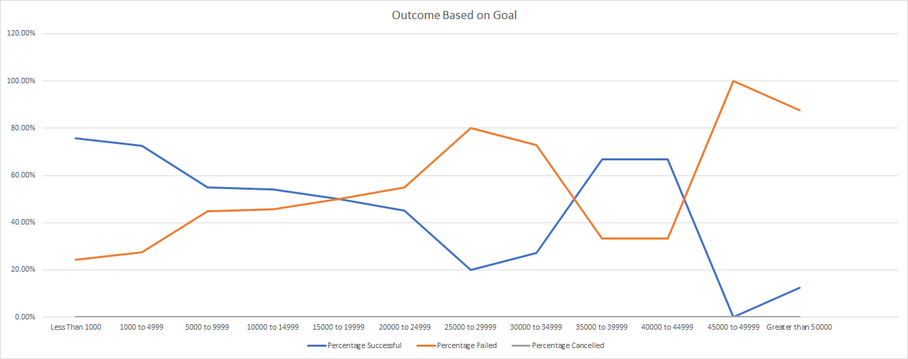
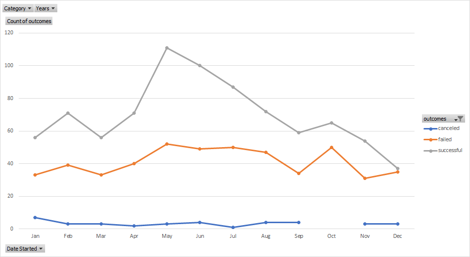

# kickstarter-analysis

Performing analysis on kickstarter data to uncover trends
An Analysis of Kickstarter Campaigns

### Challenge

The sheet "Outcomes Based on Launch Date" and its associated .png graph indicate that the best optimal months to start a campaign is May and June. Each month had at least 75 kickstarters (samples), with the month of May having the maximum number 166. The trend shown by the chart is mostly reliable. 

The sheet "Outcomes Based on Goals" and its associated .png graph indicate that the optimal goal is below $5000. When goals exceeded $5000, the success probability went from around 75% to 50%. Although the $30,000 to $50,000 range shows a surge to 66% percent, that is not a reliable number due to the low sample size (less than 20 compared to the more than 100 samples for the lower $ goals). Up to the $20,000, the chart shows a consistent trend of reduced probability of success as the goal increases, with a sample size of at least 24. Once the sample size goes below 24 counts, the trend beyond $20,000 is unpredictable/nonexistent.

Louise's kickstarter campaign ran with mostly optimal conditions, and had very little room for improvement. Her goal was $2885, which is well below the $5000 threshold for 75% success rate. Additionally, I looked at the average and median duration of Theatre campaigns; they were 31.6 and 30 days respectively. Her campaign started in June, which is the second best month of the year to launch a campaign. If she launched earlier in May or increased the duration of the campaign she may have been able to fulfill the $400 shortage of reaching her goal. 

The two .png charts below:

